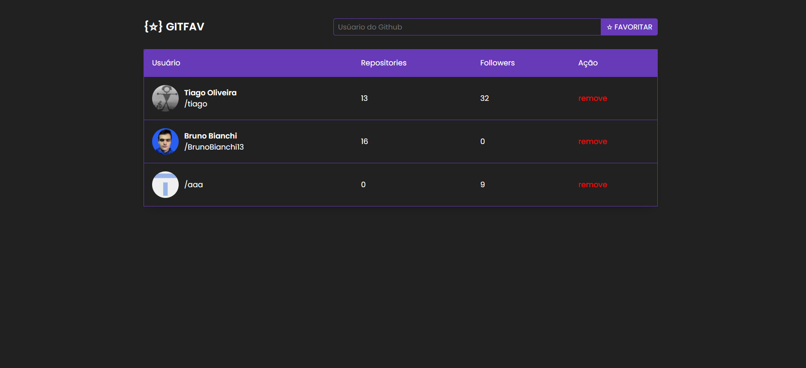

<h1 align="center"> Desafio - GitFav </h1>

Programa exclusivo do Bruno Bianchi, para ensino de tecnologias WEB.  
Desafio proposto pela Rocketseat, A ideia agora é criar o GitFav!, um sistema para favoritar perfis do Github. 

  <a href="#-tecnologias">Tecnologias</a>&nbsp;&nbsp;&nbsp;|&nbsp;&nbsp;&nbsp;
  <a href="#layout">Layout</a>&nbsp;&nbsp;&nbsp;|&nbsp;&nbsp;&nbsp;
  <a href="#-projeto">Projeto</a>

  

  

 

## 🚀 Tecnologias

Esse projeto foi desenvolvido com as seguintes tecnologias:

- HTML e CSS
- Javascript
- Git e Github

## Layout

Link do layout usado no projeto:

- [Layout Figma](https://www.figma.com/file/SzQA07HwmSPj4hOYgu1Pps/%5BDesafios-Explorer%5D-GitFav-(Copy)/duplicate?type=design&node-id=104-48&mode=design)

## 💻 Projeto

- [Acesse o projeto finalizado, online](https://brunobianchi13.github.io/Desafio-GitFav/)

---

Feito by Bruno Bianchi

